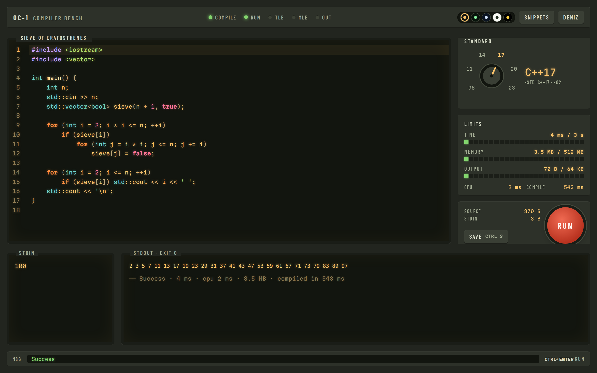
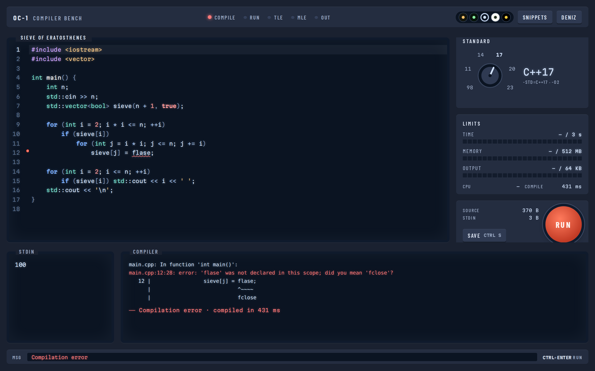
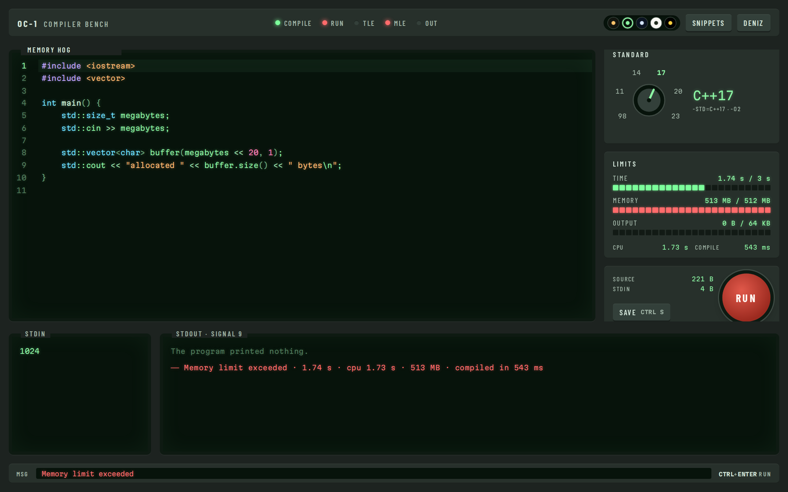
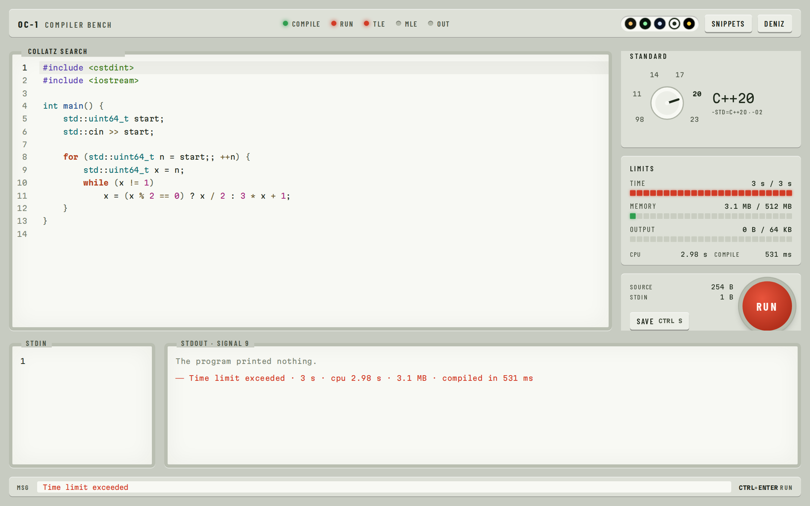
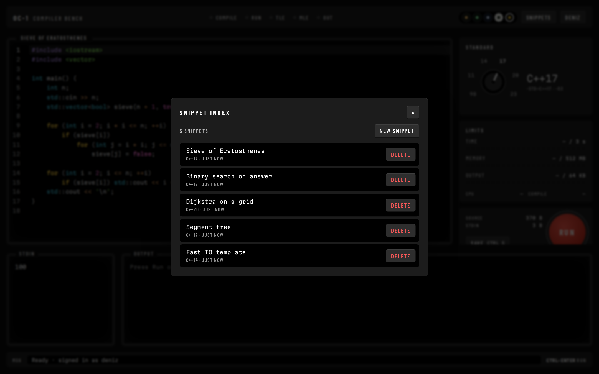
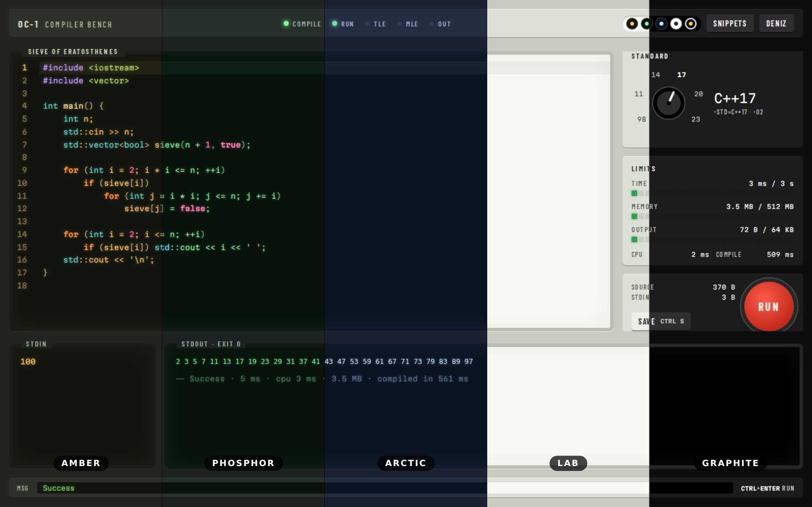
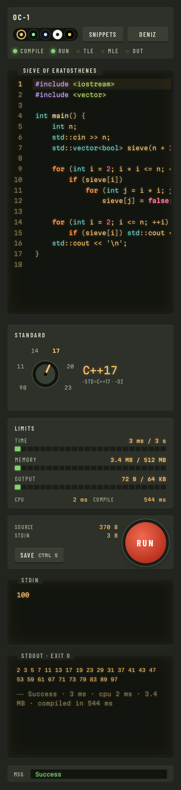
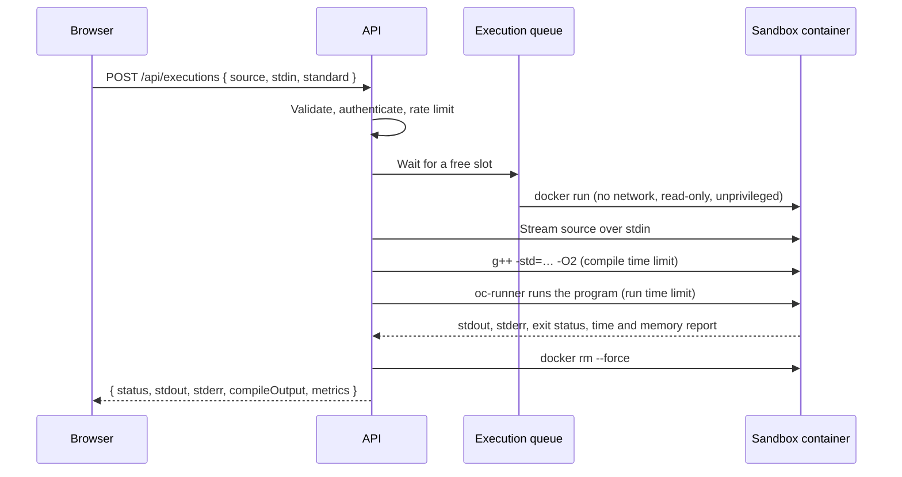

<h1 align="center">OC-1 Compiler Bench</h1>

<p align="center">
  A web-based C++ playground built like a piece of lab equipment.<br />
  Write code, feed it input and watch it run inside a locked-down, measured sandbox.
</p>

<p align="center">
  <a href="https://github.com/deniz1976/Online-Compiler/actions/workflows/ci.yml"></a>
  
  
  
</p>

<p align="center">
  
</p>

## Highlights

- **Every run is measured.** Wall time, CPU time, peak memory and compile time appear on segmented meters next to the sandbox limits.
- **Results you can read at a glance.** Status lights and a clear verdict separate success, compilation errors, runtime errors and time, memory or output limit violations.
- **Compiler errors in place.** Diagnostics are underlined in the editor, and clicking an error line in the output jumps to it.
- **Pick your screen.** Five themes, each with its own syntax palette: Amber, Phosphor, Arctic, Lab and Graphite.
- **Isolated execution.** Each run gets a fresh container with no network, a read-only filesystem, no privileges and hard resource limits.
- **Your code, kept.** Accounts, a personal snippet library in MongoDB and a local draft that survives reloads.

## A tour

<table>
  <tr>
    <td width="50%">
      
      <p><b>Compilation errors</b> are parsed from g++ output, underlined in the editor and clickable in the output panel.</p>
    </td>
    <td width="50%">
      
      <p><b>Memory limit exceeded.</b> The program tried to allocate 1 GB; the meter shows the 512 MB ceiling it hit.</p>
    </td>
  </tr>
  <tr>
    <td width="50%">
      
      <p><b>Time limit exceeded.</b> An endless search is stopped at 3 seconds. Lab is the light theme for bright rooms.</p>
    </td>
    <td width="50%">
      
      <p><b>Snippet index.</b> Saved programs with their C++ standard, ready to load. Graphite is the high-contrast theme.</p>
    </td>
  </tr>
</table>

### Five screens, one bench



Every theme defines separate colors for keywords, types, strings, numbers, comments, preprocessor directives and functions, so code stays easy to scan whichever screen you choose. The choice is remembered per browser, and first-time visitors get Lab or Amber depending on their system setting.

### On a phone



Below tablet width the panel stacks into a single column: editor, standard dial, meters, run controls, input and output.

Keyboard shortcuts:

| Keys | Action |
| --- | --- |
| <kbd>Ctrl</kbd> / <kbd>⌘</kbd> + <kbd>Enter</kbd> | Compile and run |
| <kbd>Ctrl</kbd> / <kbd>⌘</kbd> + <kbd>S</kbd> | Save snippet |
| <kbd>Ctrl</kbd> + <kbd>Space</kbd> | Autocomplete |
| Arrow keys on the dial | Change C++ standard |

<br clear="right" />

## Quick start

All you need is Docker. Compose builds the sandbox image, starts MongoDB and runs the app.

```bash
git clone https://github.com/deniz1976/Online-Compiler.git
cd Online-Compiler
cp .env.example .env
```

Fill in two values in `.env`:

```bash
# a random secret of at least 32 characters
node -e "console.log(require('crypto').randomBytes(48).toString('base64'))"

# the group id of the Docker socket as containers see it
docker run --rm -v /var/run/docker.sock:/var/run/docker.sock alpine stat -c %g /var/run/docker.sock
```

```dotenv
JWT_SECRET=<the generated secret>
DOCKER_GID=<the group id>
```

Then start everything and open http://localhost:3000:

```bash
docker compose up -d --build
```

The first build downloads the `gcc:14` image, so it takes a few minutes. Use `docker compose logs -f app` to follow the logs and `docker compose down` to stop. Data is kept in a volume until you run `docker compose down -v`.

> [!NOTE]
> In production mode the session cookie is marked `Secure`. Browsers accept that over plain HTTP only on `localhost`, so serve the app behind HTTPS when you open it from another machine, and add that origin to `CORS_ORIGINS`.

## How a run works



Docker is invoked with argument arrays and no shell, and user code and input only ever travel over stdin, never on a command line. `oc-runner` is a small static C helper baked into the sandbox image. It starts the program, enforces the time limit and reports wall time, CPU time and peak memory from `wait4`.

### Sandbox controls

| Control | Setting |
| --- | --- |
| Network | `--network none` |
| Filesystem | Read-only root; small `nosuid`, `nodev` tmpfs for the workspace and `/tmp` |
| User | Unprivileged `65534:65534` |
| Privileges | All capabilities dropped, `no-new-privileges` |
| Resources | Memory with swap disabled, CPU quota, PID limit, open file limit |
| Time | Separate compile and run limits, enforced in the container and again on the host |
| Output | stdout and stderr capped per stream |
| Concurrency | Bounded queue; excess requests get `503`, and every user is rate limited |
| Cleanup | Containers carry a label and a maximum lifetime; leftovers are removed at startup |
| Kernel isolation | Optional gVisor with `SANDBOX_RUNTIME=runsc` |

### Result statuses

| Status | Meaning |
| --- | --- |
| `success` | The program exited with code 0 |
| `compilation_error` | g++ rejected the code or ran out of time or memory while compiling |
| `runtime_error` | Non-zero exit code or a crash signal |
| `time_limit_exceeded` | The run time limit was reached |
| `memory_limit_exceeded` | The program was killed or stalled at the memory limit |
| `output_limit_exceeded` | stdout or stderr went over the output cap |

## Architecture

```
src/                        API (Express 5, TypeScript)
├── config/                 Environment validation with zod, logger
├── domain/                 Users, snippets, executions, C++ standards
├── errors/                 Typed errors mapped to HTTP responses
├── repositories/           Persistence interfaces
├── services/               Auth, snippets, executions, hashing, tokens
├── lib/                    Concurrency limiter
├── infrastructure/
│   ├── database/           Mongoose connection and models
│   ├── repositories/       MongoDB implementations
│   ├── process/            Shell-free process runner with timeouts and output caps
│   └── sandbox/            Docker sandbox runner
├── http/                   Routes, request schemas, middleware
├── docs/                   OpenAPI document generated from the request schemas
├── app.ts                  Express application factory
├── container.ts            Composition root
└── server.ts               Entry point with graceful shutdown

web/                        Client (Vite, TypeScript, CodeMirror 6)
└── src/
    ├── api/                Typed HTTP client that shares domain types with the API
    ├── domain/             Formatting, result presentation, diagnostics parsing
    ├── editor/             CodeMirror setup, C++ completions, theme-driven highlighting
    ├── state/              Small store and local draft persistence
    ├── theme/              Screen themes
    ├── ui/                 Standard dial, meters, status lights, dialogs
    └── styles/             Theme tokens and layout

sandbox/                    Sandbox image: gcc 14 and the oc-runner helper
tests/                      Unit, API and infrastructure tests
```

Dependencies point inward. Services only know domain types and repository interfaces, while MongoDB and Docker live in `infrastructure/`. The HTTP layer receives its services through `createApp`, so the whole API can be tested against in-memory implementations. The client imports the API's domain types directly, so a contract change fails the type check instead of the browser.

## API

Everything lives under `/api`. Responses use `{ "data": … }` on success and `{ "error": { "code", "message", "details?" } }` on failure. Interactive documentation is served at `/api-docs`.

| Method | Path | Auth | Description |
| --- | --- | :---: | --- |
| `GET` | `/health` | | Service and database health |
| `POST` | `/auth/register` | | Create an account |
| `POST` | `/auth/login` | | Start a session (HttpOnly cookie; the token is also returned for API clients) |
| `POST` | `/auth/logout` | | End the session |
| `GET` | `/auth/session` | | Current user, or `null` |
| `GET` | `/auth/me` | ✓ | Current user |
| `GET` | `/snippets` | ✓ | List your snippets |
| `POST` | `/snippets` | ✓ | Create a snippet |
| `GET` | `/snippets/:id` | ✓ | Get a snippet |
| `PATCH` | `/snippets/:id` | ✓ | Update title, source or standard |
| `DELETE` | `/snippets/:id` | ✓ | Delete a snippet |
| `GET` | `/executions/limits` | | Sandbox limits and supported standards |
| `POST` | `/executions` | ✓ | Compile and run `{ source, stdin?, standard? }` |

Authenticated endpoints accept the `token` cookie or an `Authorization: Bearer <token>` header.

## Configuration

Settings come from environment variables and are validated at startup; the server refuses to start with a clear message when something is missing. [`.env.example`](.env.example) lists them all.

<details>
<summary>All variables</summary>

| Variable | Default | Description |
| --- | --- | --- |
| `NODE_ENV` | `development` | `development`, `production` or `test` |
| `PORT` | `3000` | HTTP port |
| `LOG_LEVEL` | `info` | pino log level |
| `TRUST_PROXY` | `0` | Number of trusted reverse proxy hops |
| `CORS_ORIGINS` | empty | Comma-separated origins allowed to call the API |
| `MONGODB_URI` | required | MongoDB connection string |
| `JWT_SECRET` | required | At least 32 characters |
| `JWT_EXPIRES_IN_SECONDS` | `86400` | Session lifetime |
| `SANDBOX_IMAGE` | `online-compiler-sandbox:gcc14` | Image built from `sandbox/` |
| `SANDBOX_RUNTIME` | empty | Container runtime, for example `runsc` |
| `SANDBOX_MAX_CONCURRENCY` | `4` | Runs executing at the same time |
| `SANDBOX_MAX_QUEUE` | `32` | Waiting runs before `503` |
| `SANDBOX_COMPILE_TIMEOUT_MS` | `10000` | Compile time limit |
| `SANDBOX_RUN_TIMEOUT_MS` | `3000` | Run time limit |
| `SANDBOX_MEMORY_MB` | `512` | Memory per run |
| `SANDBOX_CPUS` | `1` | CPU quota per run |
| `SANDBOX_PIDS_LIMIT` | `64` | Process limit per run |
| `SANDBOX_MAX_OUTPUT_BYTES` | `65536` | Output cap per stream |
| `RATE_LIMIT_AUTH_PER_15_MIN` | `20` | Login and registration attempts per IP |
| `RATE_LIMIT_EXECUTIONS_PER_MIN` | `20` | Runs per user |
| `DOCKER_GID` | required for Compose | Group id of the Docker socket |

</details>

## Development

Requirements: Node.js 20.12 or newer and Docker.

```bash
npm install
cp .env.example .env                       # set JWT_SECRET
npm run sandbox:build
docker run -d --name mongo -p 27017:27017 mongo:8

npm run dev        # API on http://localhost:3000
npm run dev:web    # client with hot reload on http://localhost:5173
```

The Vite dev server proxies `/api` to the API. After `npm run build`, the API serves the built client on its own.

| Script | Purpose |
| --- | --- |
| `npm run dev` | API with automatic reload |
| `npm run dev:web` | Client with hot reload |
| `npm run build` | Build the API to `dist/` and the client to `public/` |
| `npm start` | Run the built server |
| `npm run sandbox:build` | Build the sandbox image |
| `npm run lint` | ESLint |
| `npm run typecheck` | Type check the API and the client |
| `npm test` | Unit, API and client tests |

### Tests

`npm test` needs no external services. Infrastructure tests against a real MongoDB and Docker daemon switch on with two variables:

```bash
MONGODB_TEST_URI=mongodb://localhost:27017/online-compiler-test \
SANDBOX_TEST_IMAGE=online-compiler-sandbox:gcc14 \
npm test
```

CI runs linting, type checks, the build, all tests including the infrastructure suite, and both Docker image builds.

## Deploying

The Compose setup runs the app as the unprivileged `node` user with a read-only filesystem and no capabilities. It joins only the Docker socket group, and MongoDB is not exposed outside the Compose network.

> [!WARNING]
> Access to the Docker socket is equivalent to root on the host. Run the service on a dedicated machine or VM, keep the sandbox image up to date and install [gVisor](https://gvisor.dev/docs/user_guide/install/) with `SANDBOX_RUNTIME=runsc` for kernel-level isolation.
